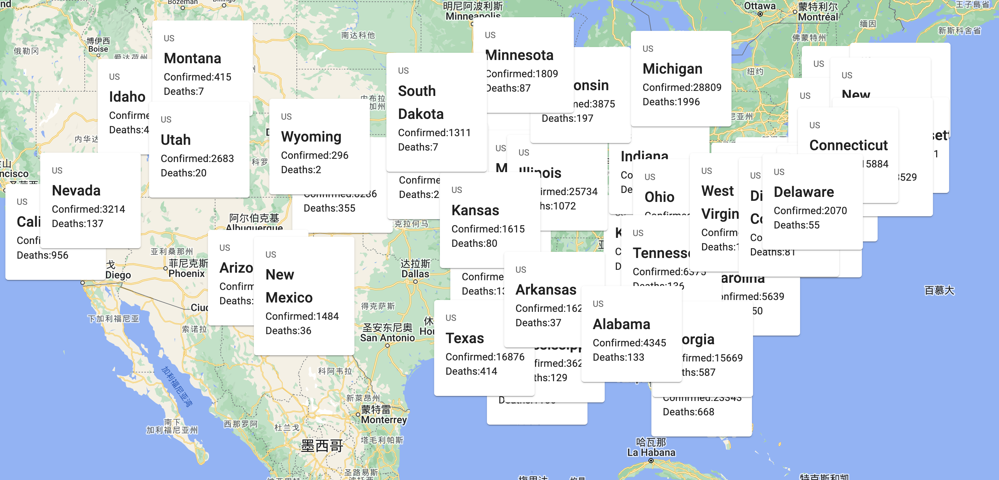

# Live Covid-19 Map

-An interactive map that displays covid statistics adaptively grouped by geographical ranges 
based on zoom level.

This project was bootstrapped with [Create React App](https://github.com/facebook/create-react-app).

## Feature
 
-Automatically display the county level or state level covid-19 statistics on the screen
-Statistics with how many people confirmed, and death
-User can choose zoom in to see the county level data or zoom out to see the state level data

-CovidCard surface was downloading from Material UI, continue exploring fancier components
-Utilize GoogleMapAPI

### `npm start`

Runs the app in the development mode.\
Open [http://localhost:3000](http://localhost:3000) to view it in your browser.

The page will reload when you make changes.\
You may also see any lint errors in the console.

